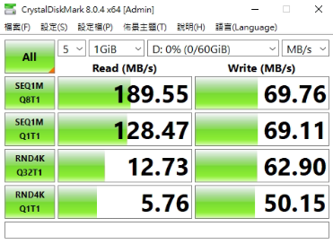

- 10:07 #到RKIT
- 發現測試機不能開卡，會停在19%
- 測試機pcie*1插了轉板，開機就沒畫面了
- NOW 用CDM測試有無patch的效能，兩者幾乎一樣，合理嗎？
  :LOGBOOK:
  CLOCK: [2023-08-25 Fri 23:12:46]
  :END:
	- 有patch
		- 
	- 沒有patch
		- [Read]
		  SEQ    1MiB (Q=  8, T= 1):   191.492 MB/s [    182.6 IOPS] < 43543.93 us>
		  SEQ    1MiB (Q=  1, T= 1):   129.671 MB/s [    123.7 IOPS] <  8081.84 us>
		  RND    4KiB (Q= 32, T= 1):    12.826 MB/s [   3131.3 IOPS] < 10203.40 us>
		  RND    4KiB (Q=  1, T= 1):     5.817 MB/s [   1420.2 IOPS] <   703.11 us>
		- [Write]
		  SEQ    1MiB (Q=  8, T= 1):    69.734 MB/s [     66.5 IOPS] <118861.91 us>
		  SEQ    1MiB (Q=  1, T= 1):    69.116 MB/s [     65.9 IOPS] < 15130.25 us>
		  RND    4KiB (Q= 32, T= 1):    63.136 MB/s [  15414.1 IOPS] <  2074.87 us>
		  RND    4KiB (Q=  1, T= 1):    49.929 MB/s [  12189.7 IOPS] <    81.83 us>