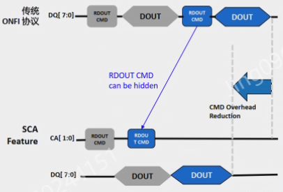
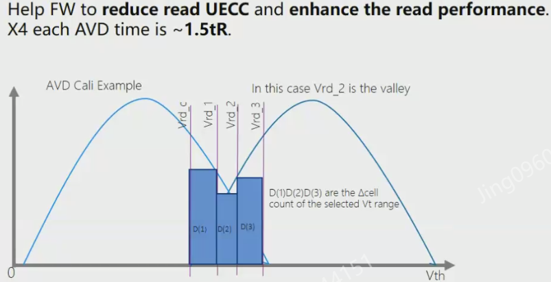
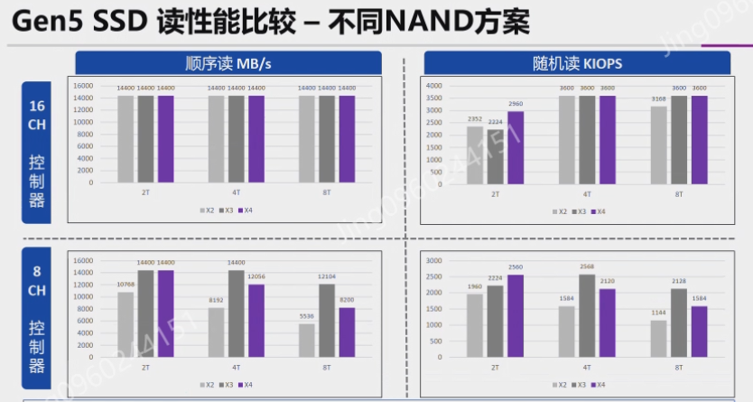

- MT可達3600MT/s
- 容量512Gb
	- X3-9070是1Tb
- 支援ONFI 5.1
- SLC read的能源效率比較，X4-9060比X3-9060還差，原因是X4的耗電流比較高
- 新功能：SCA(separate command address)
	- 
	- DQS bus專門傳輸data
	- CLE、ALE用另一條bus
	- 兩條bus可並行處理，增加data rate
		- 步驟：
		- CLE和ALE執行完第一組
		- DQS執行第一組，與此同時CLE和ALE也執行第二組，達到並行的目的
		- random read項目效能提升最高
- 新功能：AVD(auto valley detection)
	- 
	- 
	- 當兩個值的機率分佈的重疊的時候，nand會計算出最小的delta cell，也就是靠近重疊交界處的電壓值，當作新的Vth
	- 如此在發生unc時，就可以減少read retry的次數，也能減小讀取干擾
	- 要不要採用AVD，也需要考量nand計算出新的Vth需要多少時間
	- 
		- best read是實際上delta cell的最小值，可以看出AVD抓到的delta cell很接近best read的值
- X4對比X3和X2，每個block的容量提升 & block的總數下降，這是之後的趨勢
	- 好處是可以提升儲存密度
	- 壞塊是每當出現一個壞塊時，損失的容量也會變多
- X2 X3 X4寫入性能比較
	- 順序寫、隨機寫 & 8CH、16CH，共四種排列組合結果都如下：
	- 容量4T以下，X4最好
	- 容量8T，X3最好
- X2 X3 X4讀取性能比較
	- 
- 問題 #nand問題集
	- 
		- ECC recommendation (HD/SD) = 256b/567b@4KB是指HD校正4KB需要256bit的parity嗎？
	-