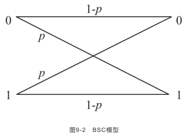
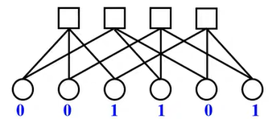
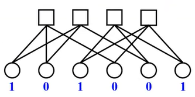

- [編碼理論6-5 Bit Flipping Decoding Algorithm - YouTube](https://www.youtube.com/watch?v=t-dO5P04WLM&list=PLhUy6HaHOGH3KVR5uC-YZ0H8pJizfM9wd&index=55)
  title:: Bit Flipping Decoding Algorithm
- BSC
	- 
- 跟BEC不一樣，不會有e
- 例1
	- 
	- 1.計算每個check node的值是否合理，也就是1的數量是否為偶數
	- 2.發現前兩個check node是不合理的
	- 3.找出這兩個check node分別連到哪些bit node
		- check node 1連到bit node 1 2 3
		- check node 2連到bit node 1 4 5
	- 4.可以看出bit node 1重覆性最高，所以將它做bit flip
	- 5.把解完的codeword拿去跟H$^T$相乘，結果為0的話表示decode成功
- 例2.
	- 
	- 1.計算每個check node的值是否合理，也就是1的數量是否為偶數
	- 2.發現前兩個check node是不合理的
	- 3.找出這兩個check node分別連到哪些bit node
		- check node 1連到bit node 1 2 4
		- check node 2連到bit node 1 2 5
- 多數決也要考慮channel