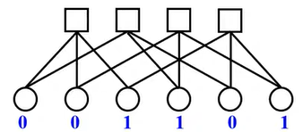
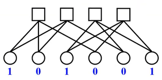

- [編碼理論6-5 Bit Flipping Decoding Algorithm - YouTube](https://www.youtube.com/watch?v=t-dO5P04WLM&list=PLhUy6HaHOGH3KVR5uC-YZ0H8pJizfM9wd&index=55)
  title:: Bit Flipping
- BSC
	- 
	- 跟BEC不一樣，不會有e
	- 判斷bit node時，採多數決
- 例1
	- 
	- 1.用多數決計每個bit node的值
		- bit node 1
			- E11 = E12 $\oplus$ E13 = 0$\oplus$1=1
			- E21 = E24 $\oplus$ E25 = 1$\oplus$0=1
			- E11、E21、channel採多數決，故決定bit node 1是1
				- channel就是codeword的值，也就是0
		- bit node 2
			- E12 = E11 $\oplus$ E13 = 0$\oplus$1=1
			- E32 = E34 $\oplus$ E36 = 1$\oplus$1=0
			- E12、E32、channel採多數決，故決定bit node 2是0
		- 以此類推，最後codeword的值就會變[1 0 1 1 0 1]，只有bit node 1被bit flip
	- 2.把解完的codeword拿去算出syndrome(syndrome = cH$^T$)相乘，結果為0，表示decode成功
- 例2
	- 
	- 1.用多數決計每個bit node的值
	- 2.最後codeword的值會變[0 1 1 1 0 1]，bit node 1和2都被bit flip
		- 
	- 3.flip之後，算出syndrome，結果不是為0，decode沒成功，要再進行下次的迭代
	- 4.下次迭代後，codeword的值又會變回[1 0 1 0 0 1]，跟原本一樣
	- 5.如此下去，一定會執行到迭代次數的上限時syndrome都不是0，結論就是decode失敗
	- 因為這個tanner graph的 ((65572aef-2653-4851-9bd2-4282f11b15f7)) 只有4，故解碼能力較弱