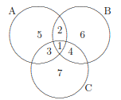
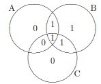
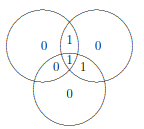
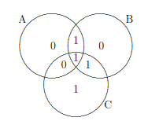

- single error correcting(SEC) codes
	- single指的是只能修正一個bit
	- (7, 4)漢明碼
		- (7, 4)的7：全部長度是7
		- (7, 4)的4：data bit是4
		- 
			- 區域1234是data
			- 區域567是糾錯碼
				- 糾錯碼要讓ABC每個圓圈裡1的數量都湊成偶數個
			- 舉例
				- 
					- 區域1234是data，分別為1101
					- 區域567是糾錯碼，為了讓圓圈ABC裡的1都是偶數個，故值分別是010
					- 所以最後要傳的codeword是1101010
					- 情況1.接收方收到的codeword是11010**0**0，也可以把它畫成三個圓
						- 
						- 會發現只有圓圈B的1不是偶數，所以把區域6的0改為1
						- 修正後，codeword就是1101010，這樣就和傳送方一致了
					- 情況2.接收方是11**1**1010
						- A、C的1都不是偶數，所以更改A、C的交集處修正為0即可
					- 情況3.接收方是11010**0****1**
						- 
						- B、C的1都不是偶數，改B、C的交集處修正為0
							- codewrod變成110**0**0**0****1**，跟傳送方不一致，證明此方法不適用於修正2個bit
		- (7, 4)漢明碼的H矩陣
			- $$\begin{bmatrix}
			    1 & 1 & 1 & 0 & 1 & 0 & 0\\
			    1 & 1 & 0 & 1 & 0 & 1 & 0\\
			    1 & 0 & 1 & 1 & 0 & 0 & 1
			    \end{bmatrix}$$
				- 第一行：因為A圓圈裡包含區域1 2 3 5，所以把第1 2 3 5的值設1
				- 第二行：因為B圓圈裡包含區域1 2 4 6，所以把第1 2 4 6的值設1
				- 第三行：因為C圓圈裡包含區域1 3 4 7，所以把第1 3 4 7的值設1
				- 若接收方的codeword沒有錯誤，則c$H^T$ = [0 0 0]
					- c: 接收到的codeword
					- 例：若收到的codeword為`0011110`，則c$H^T$如下
						- $$\left[
						   \begin{matrix}
						     0 & 0 & 1 & 1 & 1 & 1 & 0\\
						    \end{matrix}
						    \right] \left[
						   \begin{matrix}
						    1 & 1 & 1\\
						    1 & 1 & 0\\
						    1 & 0 & 1\\
						    0 & 1 & 1\\
						    1 & 0 & 0\\
						    0 & 1 & 0\\
						    0 & 0 & 1
						    \end{matrix}
						    \right]$$
						- 算出的答案為[0 0 0]，表示codeword正確無誤
		- (7, 4)漢明碼的G矩陣
			- $$\begin{bmatrix}
			    1 & 0 & 0 & 0 & 1 & 1 & 1\\
			    0 & 1 & 0 & 0 & 1 & 1 & 0\\
			    0 & 0 & 1 & 0 & 1 & 0 & 1\\
			    0 & 0 & 0 & 1 & 0 & 1 & 1
			    \end{bmatrix}$$
				- 每一行的後三個bit，都是H矩陣前4個bit轉置
			- c = uG
				- c: 欲傳送的codeword
				- u: 原始data，為1 * m的矩陣
				- G: G矩陣，為m * n的矩陣
				- 所以c會是1 * n的矩陣
				- 若u是`0011`，乘以上述的G矩陣，就會得到codeword，值是`0011110`
				- $$\left[
				   \begin{matrix}
				     0 & 0 & 1 & 1\\
				    \end{matrix}
				    \right] \left[
				   \begin{matrix}
				    1 & 0 & 0 & 0 & 1 & 1 & 1\\
				    0 & 1 & 0 & 0 & 1 & 1 & 0\\
				    0 & 0 & 1 & 0 & 1 & 0 & 1\\
				    0 & 0 & 0 & 1 & 0 & 1 & 1
				    \end{matrix}
				    \right] = \left[ \begin{matrix}
				     0 & 0 & 1 & 1 & 1 & 1 & 0\\
				    \end{matrix}
				    \right]$$