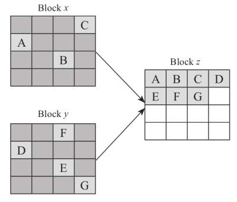

- 把SSD的檔案覆蓋或刪除時，因nand erase最小單位是block的關係，直接erase會把還需要的檔案也刪掉
- 所以實際的做法會有一到兩個步驟
	- 1.把覆蓋或刪除檔案所佔用的nand page標記為無效
		- 標記的方法有分bitmap和P2L table兩種
	- 2.若是覆蓋，會在另一個page寫入新的data
- SSD經長久使用後，通常block內都會有很多page被標記為無效，無效的page就是所謂的垃圾
- 不能讓垃圾一直累積佔用空間，把垃圾清掉回收空間的動作，就是GC
- ### GC簡單示意
	- 把兩個block的有效資料集中在第三個block，再對原本兩個block做erase，這樣就可以回收這兩個block的空間繼續寫資料
	- 
- ### GC的議題：OP和WA
	- OP = Over-Provision，超額配置
		- 一般來說SSD實際上的容量會比看到的更多，這些多出來的容量稱為OP
		- OP是為了GC而存在
		- OP會使SSD成本增加
	- WA = Write Amplification，寫入放大
		- 原本只要寫一次的data，因為執行GC的關係會把這筆data搬來搬去，造成實際上會寫入好幾次，這個現象就叫"寫入放大"
		- 寫入放大係數 = 實際寫入到nand的量/使用者寫入的量 #待處理
- ### GC的步驟
	- 一.挑選要回收的block
		- 方法1.選擇有效資料數量最小的block
			- 可以降低寫入放大係數
			- 需要多維護一張表Vaild Page Count(VPC)，用來計數每個block有效資料的量
		- 方法2.選擇erase次數最小的block(磨損均衡算法)
		- 也可以兩個方法同時考慮
	- 二.讀取欲回收block上的有效資料
		- 前提是，要如何知道每個block上每筆資料是有效 or 無效？
			- 方法1.為每個block建立一個有效/無效page的bitmap(稱作Vaild Page Bit Map - VPBM)
				- 但一個block內通常有上千個page，若是沒有DRAM可用，也必須進行多次換入換出的動作
				- 速度最快、耗費空間最大
			- 方法2.把data對應到的LBA寫進meta
				- 把整個block都讀出來，找出每一筆meta的LBA，並在L2P table中查詢該LBA對應到的物理位址是否和該筆data所在位址是否相同
					- 若是，則表示這是有效資料；反之則為無效
				- 速度最慢、佔用空間最小
			- 方法3.建立P2L table #ftl問題
				- 寫入時，會一併在P2L table標註物理位址對應到的LBA
				- GC時，會核對P2L表和L2P表來得知每個block的有效資料數量
				- 速度和佔用空間都介於中間
					- 為什麼P2L的佔用空間會比VPBM還低？P2L的最小單位不是page嗎？
	- 三.把有效資料寫到新的block
- ### GC的時機
	- 1.前景執行
		- 發現可用空間不足時被動觸發執行GC
	- 2.背景執行
		- SSD閒置時執行GC
		- 背景太頻繁GC會影響功耗