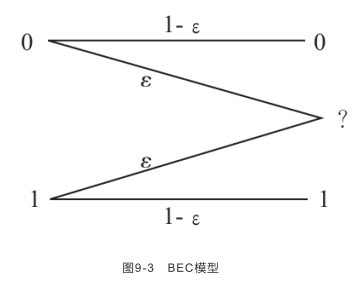
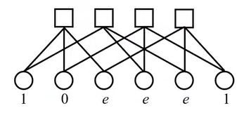
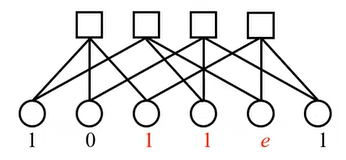

- 參考資料
	- [編碼理論6-4-1 LDPC Decoding on Binary Erasure Channel Using Message Passing Algorithm I - YouTube](https://www.youtube.com/watch?v=kfjVXio-iK4&list=PLhUy6HaHOGH3KVR5uC-YZ0H8pJizfM9wd&index=53)
	- [編碼理論6-4-2 LDPC Decoding on Binary Erasure Channel Using Message Passing Algorithm II - YouTube](https://www.youtube.com/watch?v=sr5gW9ca3rA&list=PLhUy6HaHOGH3KVR5uC-YZ0H8pJizfM9wd&index=54)
- BEC = Binary Erasure Channel
	- 
- Message Passing Algorithm是利用bit node跟check node之間的訊息交換來解碼
- 
- e表示不確定的資料
- 每個check node所連接的bit node，1的總數必需是偶數個，可利用此特性算出e是0 or 1
	- 以上圖為例，推導步驟如下
		- iter為1時
			- E13是1
				- E13指的是第一個check node到第3個bit node的值
				- 因為E13是第一個check node，它的相關node還有E11和E12
				- E11和E12總共有1個1，為了湊齊偶數，可以推出E13合理的值是1
			- E34是1
			- E25和E45都是e
		- iter為2時，把能修的e都修正，如下
			- 
			- 這樣就可以推出E25和E45都是0
		- 把e都消除後，把解完的codeword拿去跟H$^T$相乘，結果為0的話表示decode成功
		-