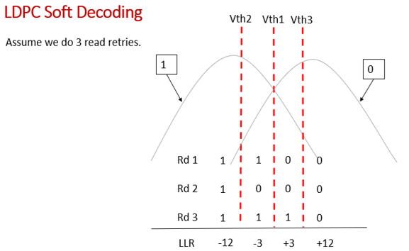

- 此篇以Q&A的角度來講解
- 
- ### 為什麼2311的LLR table需要32個LLR value
	- 當nand還很新的時候，機率分佈沒有偏掉，所以相鄰兩個值的機率分佈不會重疊，這時用hard decode設一個vth就可以decode成功
	- 但是當nand用久了，兩座山開始重疊的時候，hard decode解不掉，這時就要用到soft decode
	- soft decode會總共會用到3個vth，就像圖片一樣切3刀
	- 然後把讀到的電壓分別跟3個vth做比較，比vth還大就得到1，反之就得到0
	- vth1 vth2 vth3這樣就會分別得到rd1 rd2 rd3
		- rd1的值是用vth1對半切，左邊兩個是1，右邊兩個是0
		- rd2的值是用vht2對切，在它左邊的是1，右邊的是0
		- rd3也是同理
	- 這樣就會得到四個區間的值，每個區間都有3bit的值
	- 3bit的1/0分佈的排列組合有8個值，所以其實3bit soft decode的llr table只需要8個value就好
	- 而2311會需要32個value的原因是想要相容到5bit的soft decode
	- 5bit總共有32個值，所以這就是為什麼2311的llr table會要給到32個值的原因
	- 這32個值裡，如果是只有5bit會用到，而3bit不會用到的index都是填0
- ### 2311如何挑選出適合的llr value
	- 圖中可以看到，如果電壓比三個vth都要小的話，rd1 rd2 rd3都會是1
	- 所以index是二進位的111，但因為要相容5bit所以會再補兩個0，變成11100
	- 11100在10進位是28，所以就會在llr table index 28的地方取值，得到的值就是-12
	- 因為LLR寬度是6bit且表示法是1的補數的關係，所以轉成16進制就是0x2C
	- 因為三個vth會得到四個區間，所以總共會取4個index，另外三個取值的方式就跟剛才一樣
	  id:: 650d7d57-27b6-4238-b738-575021673d78