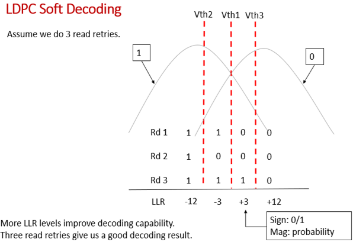

- 參考資料是2312，在2311應該也是同理
- 做soft decode，需要LLR look up table
- FW要在LDPC_DEC_LLR_CONF[3:0]填LLR value，且要填32個
- 填32個是為了相容5bit的soft decode，5bit的01排列組合有32種
- LLR value是1的補數，在2312是4bit，2311是6bit
- 在實務上3bit只會用到其中4個LLR value，5bit會用到5個LLR
- 要取哪幾個LLR value由hw決定
- 
	- 上圖是3bit的例子，hw會設定3個Vth
	- 用從nand讀到的電壓跟這3個Vth比較，分別會得到Rd1 Rd2 Rd3
		- 比Vth高就判斷為0，反之就為1，這個規則也是hw決定
	- 最後會得到3bit的數值，而因為填LLR look up table是配合5bit，所以要把這3bit擴充到5bit，不足的2bit填0即可
		- 例如：Rd1 Rd2 Rd3分別是101時，擴充到5bit就是10100
	- 值總共會有4種，分別是11100、10100、00100、00000，轉成10進制就是28、16、4、0
	- 所以實際上soft decode用到的4個LLR value就是look up table中的index28、16、4、0
		- 在2311的這些index的值分別是-12、-3、3、12
			- 因為是用1的補數的關係，且2311的LLR value是6bit，所以-12會用0x2C表示、-3用0x23表示