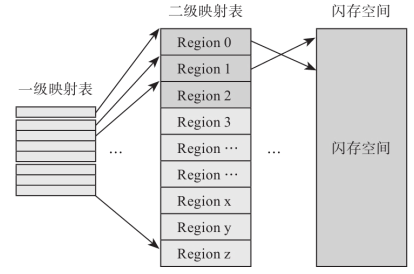
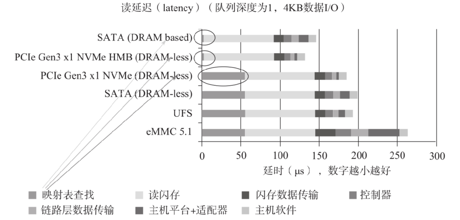

### 映射工作原理
	- 映射目的：把邏輯位址轉換為物理位址
		- 為什麼要轉換？
			- 當一個檔案寫入nand時，不會寫在連續的位址上
				- 原因是為了充份利用頻寬
				- 假設總共有n個die，就會把檔案劃成n份，分批寫進不同的die，這樣物理位址就必定不會連續
			- 所以FTL會維護一張邏輯->物理的映射表，也就是L2P table(Logical to Phsical table)
				- 讀寫SSD時，都按照邏輯位址的順序寫，但對應到的物理地址不會是連續的
	- 一個邏輯位址稱為一個LBA(logical block addrss)
	- 每個LBA的大小都相同，可能是512B or 4KB or 8KB...
- ### 映射管理方式 - 依單位區分
	- block-level mapping(塊映射)
		- 每個邏輯區域對應到一個nand blcok
		- 佔用空間小、sequence read/write性能好、random read性能好但write性能很差 #ftl問題
			- 為什麼random read/write性能不一樣
	- page-level mapping(頁映射)
		- 每個邏輯區域對應到一個nand page，或page的一部份
		- 佔用空間大、sequence read/write性能好、random read/write性能好
	- Hybrid-level mapping(混合映射)
		- 每個邏輯區域對應到一個nand blcok，而在每個邏輯區域中又劃分成好幾個邏輯頁，這些邏輯頁也對應到該nand blcok裡的page
		- 佔用空間中等、sequence read/write性能好、random read性能好但write性能差 #ftl問題
			- 為什麼佔用空間比page level mapping小，最小單位不都是page嗎？
			- 為什麼random read/write性能不一樣？
- ### L2P table
	- table size
		- 假設一個SSD的大小是256GB、LBA是8KB、且每個物理地址需要用4byte來表示
		- 計算頁映射的table大小：256GB/8KB*4 = 128KB
	- L2P table的存放位置
		- 通常主控的SRAM沒有足夠的SRAM可以塞得下完整的L2P table，所以會有幾種儲存L2P的方式
			- 1.有DRAM的SSD可以把L2P完整放進DRAM裡
			- 2.沒有DRAM的SSD採用兩級映射(二級表象)的方式執行L2P，如下圖所示
				- 
				- 一級映射表常駐在SRAM
				- 二級映射表平常放在nand裡，會依需求把當下需要的部份讀進SRAM
				- 在2311
					- 一級映射表 = system lookup table(SLUT)
						- SLUT指示GMT放在哪裡
					- 二級映射表 = global mapping table(GMT)
						- GMT指示user data放在哪裡
						- 每個GMT大小為64KB，可以對應到64MB的size
			- 3.HMB(Host Memory Buffer)
				- host也可以劃分一部分一部份的記憶體給SSD用，SSD就可以把當它自己的DRAM來用
					- 可以放進自己的L2P，以及內部的快取資料
			- 三種方式的效能參考：
				- 