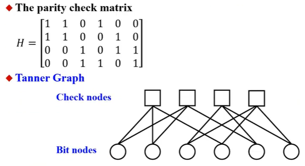
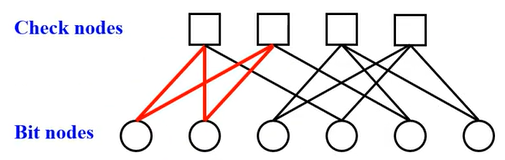

- [編碼理論6-2 Tanner Graphs - YouTube](https://www.youtube.com/watch?v=mFm-Vhon_Bo&list=PLhUy6HaHOGH3KVR5uC-YZ0H8pJizfM9wd&index=50)
- 
- tanner graph的上面是check node，下面是bit node
- check node有四個，是因為H矩陣共有四列
- bit node有六個，是因為codeword有六個bit
- H矩陣的每一列有三個1，所以本例tanner graph裡每個check node都有三條線
	- 三條線分別會接到該列為1的位置
		- 例如第一列中，第1 2 4這三個位置是1，所以tanner graph裡第一個check node就會連到第1 2 4個bit node
-
- 
	- ### cycle
		- 上圖中每一條線都是一個cycle
	- ### cycle lenth
		- 從一個check node出發，經過多個cycle(但中間的node不能有重覆的)，最後再連回一開始的check node，假設如上圖中間經過了四個cycle，則cycle lenth就是4
	- ### grith
		- 就是整個tanner graph中最小的cycle lenth
		- grith越大，代表這個H矩陣的糾錯能力越強
		-