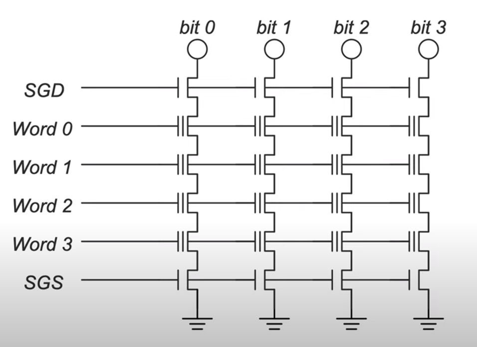

- 
- block的組成
	- 把cell排成矩陣
	- 用wordline和bitline串起矩陣中的cell
	- SGD和SGS
	  id:: 64ffd850-718c-42fd-898e-3849ff0ee1da
		- 第一個wordline之前放一條SGD
		- 最後一個wordline之後放一條SGS
		- SGD和SGS上面cell的不是FG-MOSFET，而是一般的MOSFET
		- SGD上的cell和第一個wordline的D極連接
		- SGS上的cell和最後一個wordline的S極連接
	-