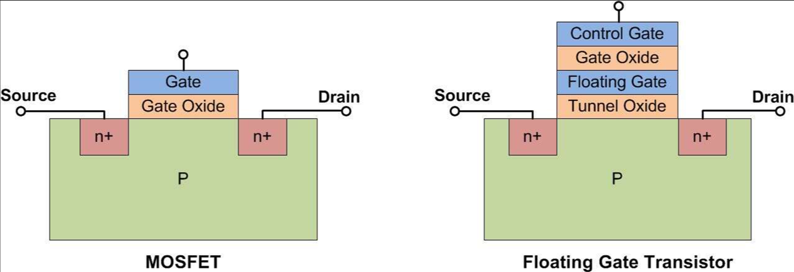

- [金屬氧化物半導體場效電晶體 - 維基百科，自由的百科全書 (wikipedia.org)](https://zh.wikipedia.org/zh-tw/%E9%87%91%E5%B1%AC%E6%B0%A7%E5%8C%96%E7%89%A9%E5%8D%8A%E5%B0%8E%E9%AB%94%E5%A0%B4%E6%95%88%E9%9B%BB%E6%99%B6%E9%AB%94)
- cell是nand flash的最小單位
- 每個cell都是一個Floating gate MOSFET
	- Floating gate的中文是浮動閘
	- MOSFET的中文是金屬氧化物半導體場效電晶體
- Floating gate MOSFET是由n-type MOSFET`(簡稱NMOS)`演化而來
- 
	- 右方是Floating gate MOSFET
	- |英文|中文|
	  |Gate|閘極|
	  |Source|源極|
	  |Drain|汲極|
	  |Control Gate|控制閘極|
	  |Gate Oxide|閘極氧化層|
	  |Floating gate|浮動閘極|
	  |Tunnel Oxide|遂道氧化層|
	- 兩者共同特性：
		- 當Vgs > Vth 且 Vgd > Vth，S極到D極就會導通
		- 只要Vgs或Vgd其中一個小於Vth，S極到D極就不會導通
	- FN穿遂效應
	  id:: 64ffd9a7-c1fa-433d-be10-4c30d659fc42
		- Floating gate MOSFET獨有特性，當Vgs>>Vth，P基板裡的電子就會穿越遂道氧化層進入浮動閘極, 此現象叫做[FN穿隧](https://ir.nctu.edu.tw/bitstream/11536/82015/7/250807.pdf)