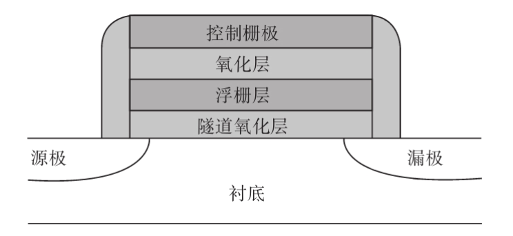

- 
	- 名詞翻譯
		- 控制柵極 - 控制閘極
		- 浮柵層 - 浮閘層
		- 漏極 - 汲極
		- 襯底 - 基板
- ### cell
	- nand flash的最小單位是Floating gate MOSFET
		- Floating gate的中文是浮動閘
		- MOSFET的中文是金屬氧化物半導體場效電晶體
	- 這種MOSFET比較特殊的地方是在閘極加入了特殊的氧化層，作為保存電子的用途
	- 每一個MOSFET在nand flash裡稱為一個cell
- ### 寫入 - program
	- 對閘極施加電壓，此時源極和汲極之間是導通的，電子會從源極流向汲極
	- 如果閘極和源極之間的壓差使得電場的強度足夠，電子就會穿越隧道氧化層，到達浮閘層
	- 由於電子被氧化層(相當於絕緣體)包覆住，即使在斷電之後，裡面的電子也能保存很長一段時間
	- 獲得電子的動作叫做充電，實際的意義就是寫入資料，在英文叫program
- ### 讀取 - read
	- 當有電子被關進浮閘層，此時閘極會需要比平常更大的電壓，源極和汲極才會導通
	- 可以利用這個特性來觀察裡頭電子數量的多寡，進而判斷cell的值是多少
	- 以SLC為例，在閘極施加低電壓
		- 如果浮閘層裡沒有電子或電子數量不多，此時MOSFET就會導通，可以判斷cell的值為1
		- 如果沒有導通，表示裡面電子有一定的數量，可以判斷cell的值為0
- ### 擦除 - erase
	- program只能讓cell的值從1變0，不能由0變回1
	- 要變回1就要進行erase，也就是放電
	- 在閘極施加負電壓，使得MOSFET的極性和program時相反，讓電子離開浮閘層，流向基板
	- 這樣浮閘層的電子都會流失，讓所有cell的值都回到1
	-