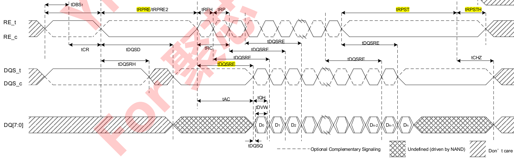

### pin腳
	- WE - Write Enable
		- 用途：command cycle, address cycle時讓nand flash latch data
			- data cycle不會使用WE
		- 控制權：在controller
		- latch的時機：rising edge
	- RE - Read Enable
		- 用途：data cycle時，指示nand flash要output data
			- read page、read id、read status都會用到
			- get feature應該也會用到，但X3-9070的datasheet沒有畫出get feature完整的時序圖
				- 後來在X3-9060 Datasheet Auto 1.0看到有get feature的時序圖，RE也會用在get feature
		- 控制權：在controller
		- latch的時機：rising edge和falling edge
	- DQS - DQ Strobe
		- 用途：data cycle時，指示出latch的時機
		- 控制權：write時在controller、read時在nand
		- latch的時機：
			- write時在rising edge和falling edge
			- read時在high/low
- ### write flow
	- {:height 244, :width 748}
	- 1.dqs會先high再low，其中
		- high的時候是dqs前置的準備時間
		- low的時候就是write preamble time([tWPRE](651a94d2-3a89-477a-a253-7f753ecc5c32))，作用是controller通知device說要寫data過去了
	- 2.接下來controller會在dq上寫入data，而且當nand flash看到dqs每一次的rising edge和falling edge，就會把data讀走
	- 3.controller在write完所有的data後，會把dqs low下來一段時間write postamble time([tWPST](651a905f-72a8-4e7f-a071-8f7e21d69e61))
	- 4.postamble結束後還有一個write postamble hold time([tWPSTH](651a9059-9de9-4953-89a4-3fc21bdfa066))，讓dqs再low一段時間
- ### read flow
	- 
	- 1.一開始一樣會有preamble，read preamble time([tRPRE](651a94d2-3a89-477a-a253-7f753ecc5c32))
		- 跟write不同的是read preamble是發生在RE上而非DQS
	- 2.preamble結束後，RE每次的rising edge和falling edge都會讓nand flash執行output data，但並非即時
		- 從edge開始到nand丟出data中間會有一段access window of DQS from RE([[tDQSRE]])的delay，過了這個delay後dq那邊才會有data
	- 3.跟write不同的是此時DQS是由nand控制，且controller讀走data的時機不是在rising edge和falling edge，而是在high/low
	- 4.等controller把data都讀完之後，最後一樣會有read的postamble([tRPST](c22bc504-4025-470f-814b-78b28061dc58))和postamble hold time([tRPSTH](e6398602-918b-4412-8ecf-02a9c2ee4685))
-