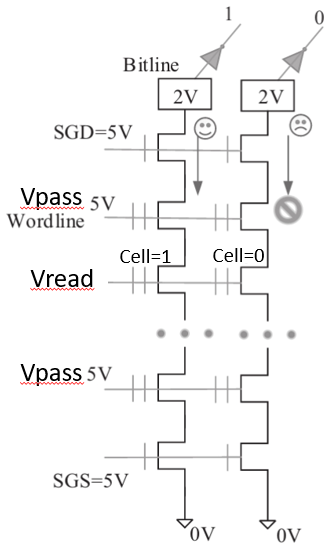

- 
- read的最小單位是一個wordline
- 為了讓bitline導通，除了在欲讀取的wordline之外，其它wordline都施加Vpass
	- Vpass為5V，5V可以讓的cell的SD極導通，但不引發[FN穿遂效應](64ffd9a7-c1fa-433d-be10-4c30d659fc42)
- 在SGD和SGS施加5V，讓這兩條的cell也導通
- 在欲讀取的wordline上施加Vread
- 矩陣中有電流感應電路，找出要read的cell的bitline
- 看看該bitline有無電流，來判斷該bit是0或1
	- 以SLC為例
		- 如果該bitline有電流，表示cell的值是1
		- 如果該bitline沒有電流，表示cell的值是0