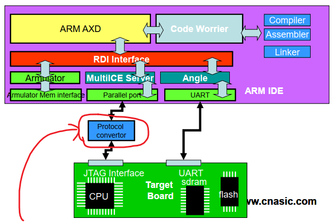
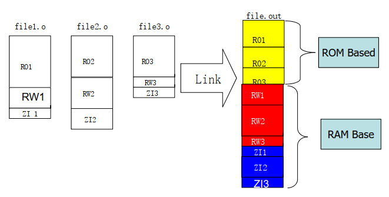
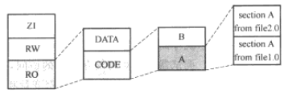
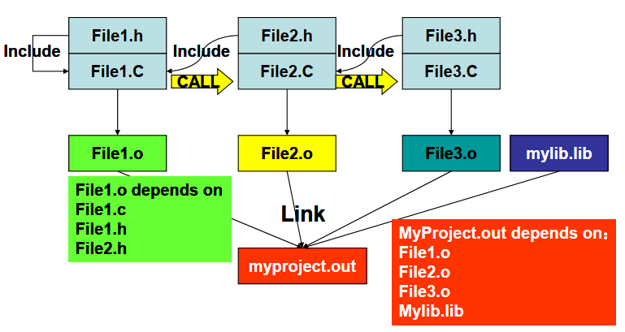

- 
	- 很多人都會把protocol convertor叫做ICE，但其實它不是ICE，現在的ICE已經做在MCU裡面了
	- protocol convertor是把pc的usb訊號轉換為jtag訊號
- ### toolchain
	- 由compiler、assembler、linker和函式庫管理器組成
	- compiler(編譯器)
		- 將c語言轉換為組合語言
	- assembler(組譯器、匯編器)
		- 將組合語言轉換為目標檔(.o檔)
			- 每個.o檔都是獨立編址，意思是它們都會把第一條指令放在最開頭的位址
				- 因為組譯器是以一個檔案為單位來做轉換，它在轉換時，完全不會考慮是否還有其它檔案
	- linker
		- 將多個.o檔和函式庫，針對裡面的元素進行重新編址，產生輸出檔(如下圖)
			- 輸出檔就是要燒錄到MCU的檔案
		- 嵌入式系統一般的輸出檔是使用絕對地址(非PIC)，但ARM是相對地址(PIC)，相對於PC(應該是指程式計數器)
			- 有關PIC，目前還不是很懂，可參考[嵌入式知识-ARM裸机-学习笔记（4）：重定位与链接脚本的使用-CSDN博客](https://blog.csdn.net/qq_42826337/article/details/104478319)
			- linker還有做一件事：重定位，這邊也還沒弄清楚，也許可參考[详解：链接中的重定位 - 知乎 (zhihu.com)](https://zhuanlan.zhihu.com/p/419683114)和一本書"鏈接器和加載器"
		- 
- ### 目標檔的結構
	- 可略分為TEXT和DATA兩段
		- TEXT放程式碼，一般放在低位址
		- DATA放資料(全域變數、[字串常數](6541dfc3-09a2-46c3-b805-94aeb5ea0886) )，一般放在高位址
	- 不同編譯器之間的規則也不盡相同，例如ARM是為三段
		- RO(Read Only)：放程式碼和常數
		- RW(Read and Write)：放有指定初始值的全域變數
		- ZI(Zero Init)：放沒有指定初始值的全域變數
		- 在系統啟動時，linker會將ZI段全部清零，並對RW段設定初始值
		- 
- ### ARM處理的開發工具 - ADS
	- 影片沒有
	- 半主機感覺蠻有趣的，有空可以試試
- ### make
	- 好處1.處理檔案間的相依性
		- 
		- File1.o依賴於File1.c、File.h、File2.h
			- 意思是只有這三個檔案改變時，才需要重新產生File.o
			- File2.c改變，不需要重做File1.o，因為它們沒有相依性
	- 好處2.只build需要的檔案
		- make程式會依照檔案最後的修改時間來判斷是否重新執行complier
			- 例：File1.o依賴於File1.c、File.h、File2.h
				- 當File1.o的修改時間比其它三個檔案還新時，make就不會重新build File1.o，以節省時間
				- 反之File1.o只要比其中一個還舊，make就會build File1.o
			- 如果build code的動作是在另一台電腦或是VM，要注意兩台系統時間是否同步
				- 假設寫code的是系統A，build code的是系統B
				- .c和.h檔保存在A，.o檔保存在B
				- 若A比B的系統時間還慢，有可能會發生改了code，但B卻不會build .o檔的情形
					- 因為.o檔的修改時間比.c/.h檔還要新，所以make判斷不需build
					- 解決方式：先執行clean，或把對應的.o檔砍掉
						- 書上有說可以"通過時間服務來同步項目組中的所有計算機時間"，但我查了一下，這好像不是make可以做到的事情