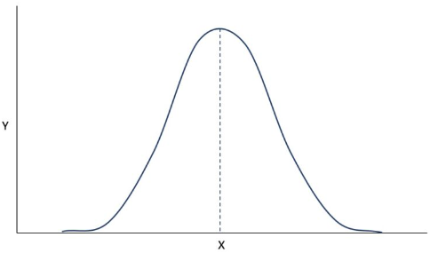

- 參考資料：
	- Hardy
	- Bing
	- [常態分布 - Wikiwand](https://www.wikiwand.com/zh-tw/%E6%AD%A3%E6%80%81%E5%88%86%E5%B8%83)
- 高斯分佈是一種描述數據分布的模型，它的圖形像一個鐘形，所以也叫鐘形曲線(如圖) 
- 像是人類的身高、智商、測量誤差等，只要取樣數量夠大，統計出的分佈曲線都會和高斯分佈很相似
	- 例如：非常聰明和非常笨的人都很少，大多數人的智商都在這兩者的中間
		- 就像鐘形曲線裡，X軸上偏左和偏右的Y值都很小，Y值最大的地方都集中在這兩者中間
- 大量統計獨立的隨機變數的平均值的分布趨於常態分布，這個結論稱為"中央極限定理"
- 高斯分佈也是[[LLR]]的基礎之一